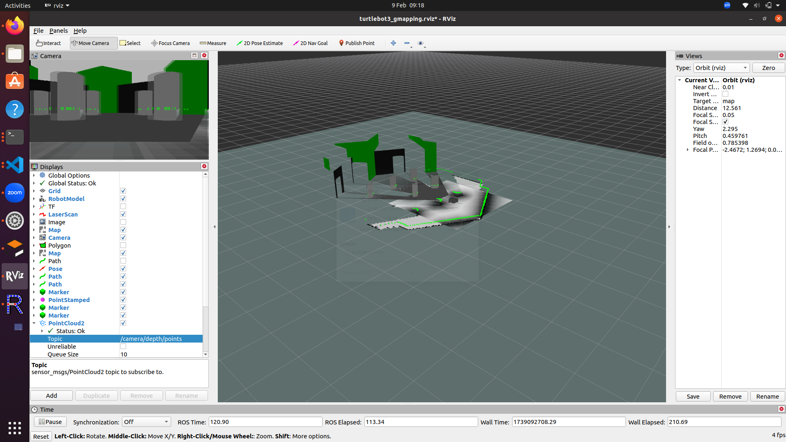
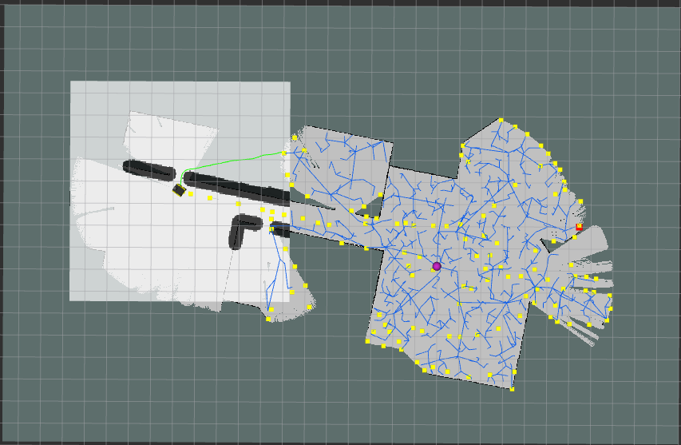

# Automated 3D Environment mapping Robot
This Project uses a Jackal robot what automatically drives and created high definition 3D maps of environments using SLAM and RRT.
## How to run
```bash
cd catkin_ws
catkin_make
```

## Examples

3D Mapping

[](assets/3dMap.mp4)

2D mapping

[](assets/2dMap.mp4)

